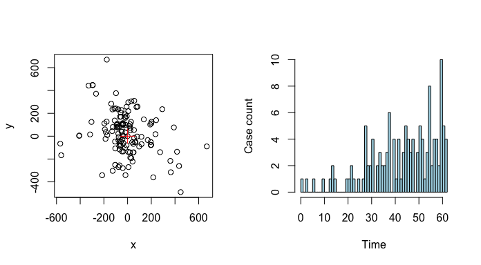
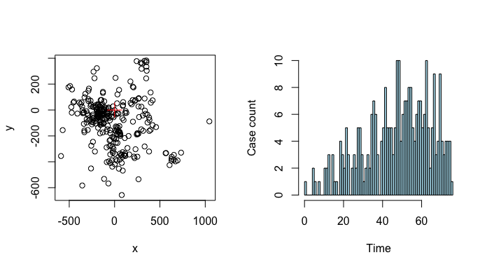
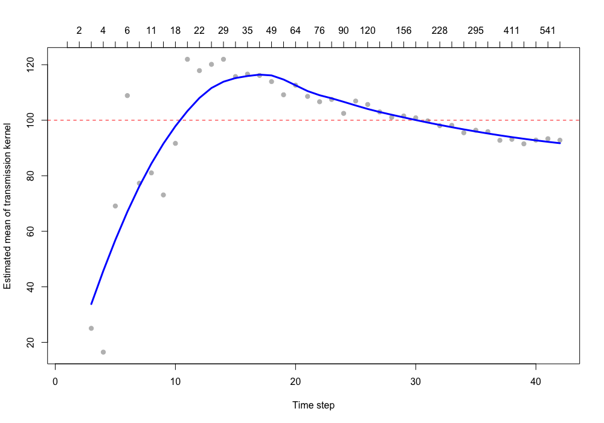
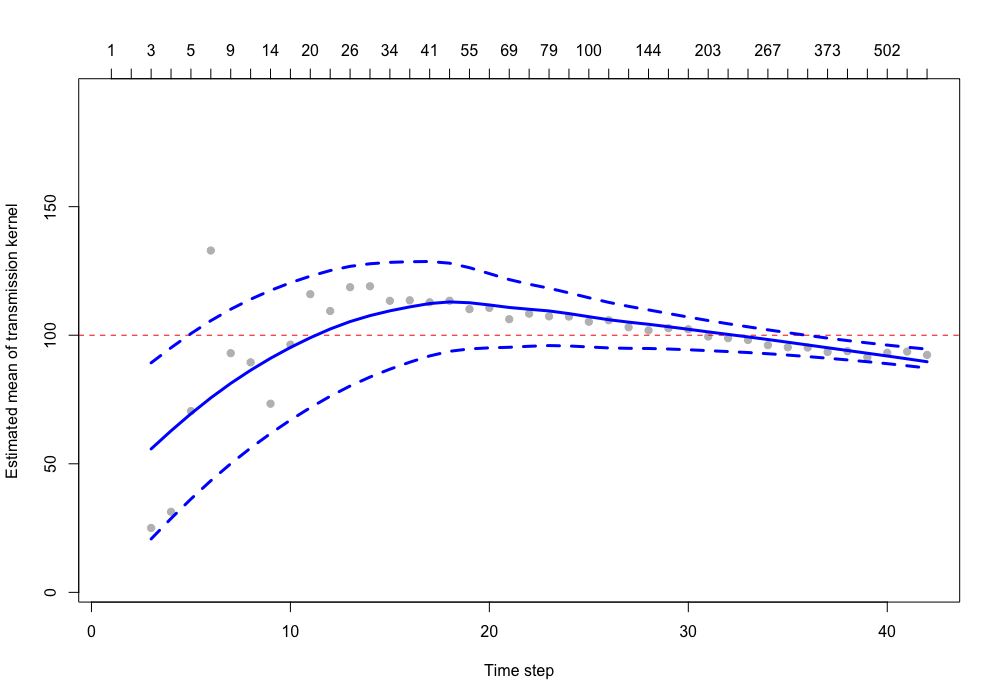
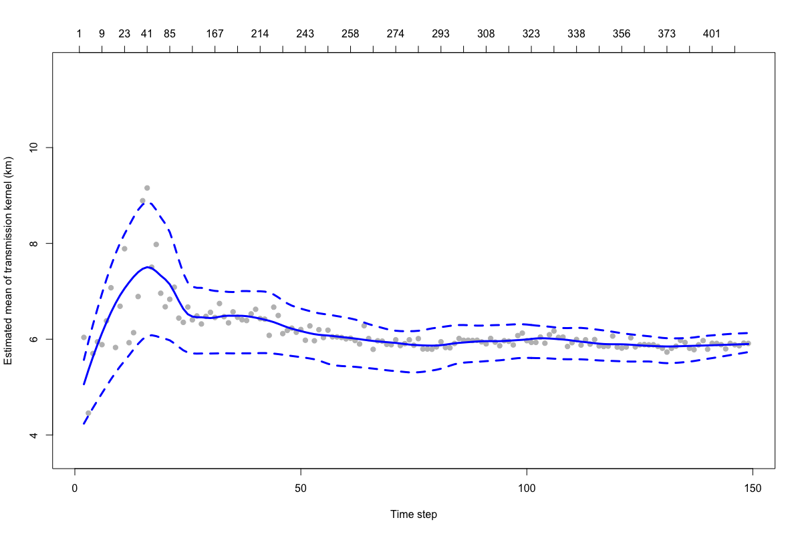

```{r, echo=F, message=F}
library(IDSpatialStats)
```

## Introduction
When analysing the spatial dynamics of an epidemic, transmission from one individual to another is often characterized by the spatial distance separating two linked cases. Describing this fundamental aspect of the transmission process requires the a reconstruction of transmission pathways which link individual cases. However, this information is often unavailable or incomplete due to poor case detection and the high cost of contact-tracing. Therefore, we developed an approach that uses information on case location, onset time, pathogen generation time to estimate the mean spatial distance of transmission events. The method does not require data on individual transmission pathways and is robust in settings where data are partially observed.

This vignette describes how to use functions in the `transdist` family of the `IDSpatialStats` package. These functions allow the user to simulate spatial epidemic data and estimate the mean of the transmission kernel and its change over the duration of an epidemic. Derivation of the statistical methods employed by these functions are described in detail by Salje et al. [-@salje_estimating_2016]. The functions used in this vignette are implemented in `IDSpatialStats` versions `0.3.4` and above.

## Simulating epidemics
We use a stochastic spatial branching process to simulate epidemiological data in the `sim.epidemic` function. Simulations begin with an index case at $(x,y,t) = (0,0,0)$ and transmission events that link two cases follow according to a random Markov process in $(x,y)$ space (i.e. Brownian motion). The spatial distance traversed by each transmission event is given by a user specified probability distribution which serves as the kernel function. The number of branching events (i.e. when one individual transmits to $>2$ individuals) occurs according to a Poisson distribution, with its mean and variance set to the basic reproduction number $R_0$ of the infectining pathogen.

When specifying the spatial kernel, the `trans.kern.func` argument expects a list object containing a probability distribution function and its named arguments. For example, to simulate an epidemic where transmission typically occurs at the local level, but long distance transmissions events sometimes occur, an exponential transmission kernel might be used because of its long tail. Alternatively, if transmission is expected to consistently occur within a given range, then a normal kernel may be more appropriate.

```{r, eval=FALSE}
set.seed(123)

# Exponential transmission kernel with mean = sd = 100
dist.func <- alist(n=1, a=1/100, rexp(n, a))

# Simulate epidemic with constant R value
a <- sim.epidemic(R=1.5,
                  gen.t.mean=7,
                  gen.t.sd=2,
                  min.cases=100,
                  tot.generations=10,
                  trans.kern.func=dist.func)
sim.plot(a)
```
```{r, echo=FALSE, fig.width=7.25, fig.height=4, cache=FALSE, message=F, fig.cap='\\label{fig:sim1} **Left:** the spatial distribution of simulated cases with the red cross showing the index case. **Right:** the simulated epidemic curve giving case counts over time'}

```

In simulations with a constant $R$ value, the number of cases will continue to increase with each time step. This effect may not be appropriate when simulating settings where intervention efforts or depletion of susceptibles causes heterogeneity in $R$ over the course of the epidemic. Thus, the `sim.epidemic` function accepts either a scalar value for a constant $R$ value or a vector of $R$ values with a length equal to `tot.generations`, allowing simulations with a variable $R$ value.

```{r, eval=FALSE}
# Simulate epidemic with variable R value
R1 <- 2
R2 <- 0.5
tg <- 12
R.vec <- seq(R1, R2, (R2 - R1)/(tg - 1))

a <- sim.epidemic(R=R.vec,
                  gen.t.mean=7,
                  gen.t.sd=2,
                  min.cases=100,
                  tot.generations=tg,
                  trans.kern.func=dist.func)
sim.plot(a)
```
```{r, echo=FALSE, fig.width=7.25, fig.height=4, fig.cap='**Left:** the spatial distribution of simulated cases with the red cross showing the index case. **Right:** the epidemic curve for a simulation with an $R$ value decreasing from 2 to 0.5 over the course of the epidemic'}

```

## Estimation of mean transmission distance $\mu_t$
Our approach estimates the mean spatial distance traversed during a transmission event using information on the location $(x, y)$ and onset time $t$ of each case, and the infecting pathogen's generation time $g(x)$. Pathogen generation time is used to probabalistically estimate the number of transmission events required to link two cases, denoted as $\theta$. In settings where genetic data or contact tracing provide evidence for $\theta$, the mean transmission distance can be directly calculated as the mean observed distance between all linked case pairs occurring within two time points $t_1$ and $t_2$ to give $\mu^{obs}_t(t_1, t_2)$. However, this assumes the number of transmission events separating all case pairs is homogeneous ($\theta = 1$). When data that indicate case linkage is lacking, this assumption is limiting because the distance between two cases depends on the number of transmission events separating them. Therefore, the mean transmission distance at each time interval $\mu_t$ must be estimated as a weighted mean:
$$
\mu_t(t_1,t_2,\mu_k,\sigma_k) = \sum_i w(\theta=i,t_1,t_2) \cdot \mu_a(\theta=i,\mu_k,\sigma_k).
$$
Where, $w(\theta=i,t_1,t_2)$ gives the weight for each of the $i$ elements of $\theta$ and the second term $\mu_a(\theta=i,\mu_k,\sigma_k)$ gives the mean distance separating case pairs that are linked by the $i$th value of $\theta$.

We have implemented four nested functions that are used to estimate $w(\theta=i,t_1,t_2)$. Listed in order, they are comprised of `est.wt.matrix.weights`, `est.wt.matrix`, `get.transdist.theta`, and `est.transdist.theta.weights`. Although, these functions are documented separately, they are all driven by the `est.transdist` family of functions and do not need to be run manually unless desired.

### Calculate Wallinga-Teunis matrices
The `est.wt.matrix.weights` function buids upon code from the `R0` package [@R0_package_2015] to calculate the basic Wallinga-Teunis matrix [@wallinga_different_2004]. This matrix gives the probability that a case at time $t_i$ (rows) infects a case at time $t_j$ (columns), i.e. ($\theta = 1$), based on the generation time distribution of the pathogen $g(x)$. For an epidemic of with $t$ unique case times, `est.wt.matrix.weights` gives a $t \times t$ matrix.
```{r, eval=FALSE}
case.times <- c(1,2,2,3,3)
g.x <- c(0, 2/3, 1/3, 0, 0) # must sum to 1
a <- est.wt.matrix.weights(case.times=case.times, gen.t.dist=g.x); a
```

The `est.wt.matrix` function produces a Wallinga-Teunis type matrix for all infector-infectee case pairs. Given the Wallinga-Teunis matrix produced by `est.wt.matrix.weights` and total case count $n$, this function calculates an $n \times n$ matrix giving the probability that case $i$ (rows) infected case $j$ (columns). The Wallinga-Teunis matrix in object `a` can be handed directly to `est.wt.matrix` via the `basic.wt.weights` argument, or if this argument is `NULL`, the `est.wt.matrix.weights` function is called automatically.
```{r, eval=FALSE}
b <- est.wt.matrix(case.times=case.times, gen.t.dist=g.x, basic.wt.weights=a)
b <- est.wt.matrix(case.times=case.times, gen.t.dist=g.x); b # both are equivalent
```

### Estimation of weights of $\theta$
The `get.transdist.theta` estimates the number of transmission events $\theta$ separating pairs of cases using the probabilities in the infector-infectee Wallinga-Teunis matrix produced by the `est.wt.matrix` function. Sampling all possible transmission trees is impractical for most datasets, so this function constructs a transmisison tree by randomly selecting the infector of each case in the epidemic and then $\theta$ is determined by finding the product of all probabilites in the chain of transmission that link the randomly sampled case pairs.
```{r, eval=FALSE}
gen.time <- 1
n.gen <- round((max(case.times) - min(case.times)) / gen.time) + 1 # Number of generations

c <- get.transdist.theta(wal.teun.mat=b,
                         cases=case.times,
                         gen.t.mean=gen.time,
                         max.sep=n.gen*2)
```

The object `c` here contains a three-dimensional array [$i$,$j$,$\theta$], where the rows $i$ and columns $j$ represent unique case times and      the third dimension $k$ is the number of transmission events $\theta$. Each cell gives the probability that two cases occurring at times $i$       and $j$ are connected by $\theta$ transmission events in the randomly sampled transmission tree. Probabilities in each [$i$,$j$, ] row are        normalized across all $\theta$ values. The `get.transdist.theta` function samples a single randomized transmission tree from the epidemic          data, therefore we want to simulate many interations of this random sampling to get a better estimate of the true distribution of $\theta$.

The `est.transdist.theta.weights` function estimates the distribution of $\theta$ across all $t_i$ and $t_j$ combinations by simulating many iterations of transmission trees using the `get.transdist.theta` function. Its output is the same the `get.transdist.theta` function, however, it represnts the normalized probabilites after `n.rep` number of simulations.
```{r, eval=FALSE}
d <- est.transdist.theta.weights(case.times=case.times,
                                 n.rep=5,
                                 gen.t.mean=gen.time,
                                 t1=0,
                                 t.density=g.x)
```

### Estimating mean of transmission kernel $\mu_k$
To estimate the overall mean of the transmission kernel over the duration of the epidemic we must combine all measures of $\mu_t$ into an overall measure $\mu_k$. The workhorse function `est.trandsdist` estimates the overall mean $\mu_k$ and standard deviation $\sigma_k$. This function first calls the `est.wt.matrix.weights`, `est.wt.matrix`, `get.transdist.theta`, and `est.transdist.theta.weights` functions described above to estimate the distribution of $\theta$ across all case pairs and then calculates each of the weights $w(\theta=i,t_1,t_2)$. The weights are calculated as the proportion of all case pairs occuring at $t_i$ and $t_j$ that are separated by each estimated $\theta$ over all simulations:
$$
\hat{w}(\theta = i, t_1, t_2) = \frac{\sum^{N_{sim}}_{k=1} \sum^n_{i=1} \sum^n_{j=1} \boldsymbol{I}_1(t_i=t_1, t_j=t_2, \Theta_{ij} = \theta)}
                                     {N_{sim} \sum^n_{i=1} \sum^n_{j=1} \boldsymbol{I}_2(t_i=t_1, t_j=t_2)}.
$$
Here, the functions $\boldsymbol{I}_1$ and $\boldsymbol{I}_2$ indicate if two cases occurred at time $t_i$ and $t_j$ and were linked by $\theta$ transmission events, or if they just occurred at $t_i$ and $t_j$ respectively. In words this can be written as:
$$
\hat{w}(\theta = i, t_1, t_2) = \frac{\text{Number of cases at} \,t_1\, \text{and} \,t_2\, \text{across all simulations separated by} \,\theta\, \text{transmission events}}
                                     {\text{Number of cases at} \,t_1\, \text{and} \,t_2\, \text{across all simulations}}.
$$

Once the weights of the $\theta$ values are estimated, the `est.transdist` function calculates the mean $\mu_k$ and standard deviation $\sigma_k$ as the average weighted estimate over all combinations of $t_i$ and $t_j$. If we now let $k$ index the vector of $\theta$ values, then:
$$
\hat \mu_k = \hat \sigma_k = \frac{1}{\sum_i \sum_j n_{ij}} \sum_i \sum_j \frac{2 \cdot \mu^{obs}_t (t_i,t_j) \cdot n_{ij}}{\sum_k \hat w (\theta = k, t_i,t_j) \cdot \sqrt{2 \pi k}}.
$$
For a derivation of this equation from the mean squared dispersal distance, see section 2.3 of Salje et al. [-@salje_estimating_2016].

The `est.trandist` function requires the epidemiological data to be a matrix with three columns [$x$,$y$,$t$] and estimates of the mean and standard deviation of the infecting pathogen's generation time (for calculating Wallinga-Teunis matrices). Additional constraints on the estimation of $\mu_k$ and $\sigma_k$ can be defined in the remaining arguments, such as the time step in which the analysis should begin (`t1`), the maximum number of time steps (`max.sep`) and spatial distance (`max.dist`) to consider when estimating $\theta$, the number of randomized transmission tree simulations to run (`n.transtree.reps`).
```{r, eval=FALSE}
set.seed(123)

dist.func <- alist(n=1, a=1/100, rexp(n, a))

# Simulate epidemic
a <- sim.epidemic(R=2,
                  gen.t.mean=7,
                  gen.t.sd=2,
                  min.cases=100,
                  tot.generations=8,
                  trans.kern.func=dist.func)

# Estimate mean and standara deviation of transmission kernel
b <- est.transdist(epi.data=a,
                   gen.t.mean=7,
                   gen.t.sd=2,
                   t1=0,
                   max.sep=1e10,
                   max.dist=1e10,
                   n.transtree.reps=10)
```

The output of the `est.transdist` function contains estimates of $\mu_k$ and $\sigma_k$ under the assumption that mean and standard deviation of the dispersal kernel are equal. If this expectation is not met, i.e. $\mu_k \gg \sigma_k$ or $\mu_k \ll \sigma_k$, the upper bounds for $\mu_k$ and $\sigma_k$ can be found by taking $\sqrt 2$ times the values estimated under the assumption of equality (see section 2.5 of Salje et al. [-@salje_estimating_2016]).

### Uncertainty around mean estimate
To estimate the uncertainty around $\hat{\mu}_k$ due to observation error, we have implemented a wrapper function called `est.transdist.bootstrap.ci` that performs bootstrap iterations using the `est.transdist` function. Upon each iteration, the epidemiological data are resampled with replacement and $\mu_k$ is re-estimated. The `est.transdist.bootstrap.ci` function contains all the same arguments as the `est.transdist` function, with additional arguments defining the number of bootsrapped iterations to perform, the high and low boundaries of the desired confidence interval, and options for running the bootstrap analysis in parallel.

```{r, eval=FALSE}
b <- est.transdist.bootstrap.ci(epi.data=a,
                                gen.t.mean=7,
                                gen.t.sd=2,
                                t1=0,
                                max.sep=1e10,
                                max.dist=1e10,
                                n.transtree.reps=10,
                                boot.iter=10,
                                ci.low=0.025,
                                ci.high=0.975)
```

When parallel computation is enabled (the default is `parallel` = `FALSE`), the function uses the `makeCluster()` function of the `parallel` package to make the appropriate cluster type for the operating system of the local machine (SOCK cluster for Windows or a Fork cluster for Unix-like machines). The cluster is then registered as the parallel backend for the `foreach` package, which is used to run the bootstraps in parallel. If the the `n.cores` argument is `NULL` the function will automatically use half of the clusters available on the local machine. The user can also manually define the number of cores in the `n.cores` argument.

```{r, eval=FALSE}
b <- est.transdist.bootstrap.ci(epi.data=a,
                                gen.t.mean=7,
                                gen.t.sd=2,
                                t1=0,
                                max.sep=1e10,
                                max.dist=1e10,
                                n.transtree.reps=10,
                                boot.iter=10,
                                ci.low=0.025,
                                ci.high=0.975,
                                parallel=TRUE,
                                n.cores=2)
```

### Change in mean transmission distance over time
An estimate of $\mu_k$ over the duration of an epidemic is indicative of the overall spatial dependence in the transmission process. However, conditions may change over the course of an epidemic that alter the spaital scale upon which transmission operates. The `est.transdist.temporal` function estimates the change in $\mu_k$ over time to quantify temporal heterogeneity in the spatial dependence of transmission. This function re-estimates $\mu_k$ for all cases leading up to each unique time step. Some time steps at the beginning of an epidemic may be returned as `NA` if there are not enough unique cases to estimate $\mu_k$ and/or its bootstrapped confidence intervals for a given time step. Note that this method uses the cumulative number of cases up to each unique time step to calculate the change in $\mu_k$ over time. So, estimates made for time steps early in the epidemic may be affected by sampling error due to low sample size. 

```{r, eval=FALSE}
# Estimate mean transmission kernel over time
b <- est.transdist.temporal(epi.data=a,
                            gen.t.mean=7,
                            gen.t.sd=2,
                            t1=0,
                            max.sep=1e10,
                            max.dist=1e10,
                            n.transtree.reps=5,
                            mean.equals.sd=TRUE,
                            parallel=FALSE)

plot(b[,1], pch=19, col='grey', ylim=c(min(b[,1], na.rm=TRUE), max(b[,1], na.rm=TRUE)), 
     xlab='Time step', ylab='Estimated mean of transmission kernel')
abline(h=100, col='red', lty=2)
axis(3, 1:nrow(b), b[,2])

low <- loess(b[,1] ~ as.vector(1:length(b[,1])))
low <- predict(low, newdata=data.frame(as.vector(1:length(b[,1]))))
lines(low, lwd=3, col='blue')
```
```{r, echo=FALSE, out.width='100%', fig.cap='Output from the `est.transdist.temporal` function showing the change in the mean transmission distance over the course of a simulated epidemic. Point estimates are plotted as grey circles and a loess smooth of the mean estimate is plotted with the blue line. Sample size is plotted on the top axis.'}

```

Bootstrapped confidence intervals for the change in $\mu_k$ over time can also be estimated using the `est.transdist.temporal.bootstrap.ci` function.
```{r, eval=FALSE}
nc <- parallel::detectCores() # use all available cores

b <- est.transdist.temporal.bootstrap.ci(epi.data=a,
                                           gen.t.mean=7,
                                           gen.t.sd=2,
                                           t1=0,
                                           max.sep=1e10,
                                           max.dist=1e10,
                                           n.transtree.reps=10,
                                           mean.equals.sd=TRUE,
                                           boot.iter=10,
                                           ci.low=0.025,
                                           ci.high=0.975,
                                           parallel=TRUE,
                                           n.cores=nc)
  
  plot(b[,1], pch=19, col='grey', ylim=c(min(b[,1:3], na.rm=TRUE), max(b[,1:3], na.rm=TRUE)), 
       xlab='Time step', ylab='Estimated mean of transmission kernel')
  abline(h=100, col='red', lty=2)
  axis(3, 1:nrow(b), b[,4])
  
  low <- loess(b[,1] ~ as.vector(1:nrow(b)), span=1)
  low <- predict(low, newdata=data.frame(as.vector(1:nrow(b))))
  lines(low, lwd=3, col='blue')
  
  for(i in 2:3) {
    low <- loess(b[,i] ~ as.vector(1:nrow(b)), span=1)
    low <- predict(low, newdata=data.frame(as.vector(1:nrow(b))))
    lines(low, lty=2, lwd=3, col='blue')
  }
```
```{r, echo=FALSE, out.width='100%', fig.cap='Output from the `est.transdist.temporal.bootstrap.ci` function showing the change in the mean transmission distance over the course of a simulated epidemic. The point estimates are plotted as grey circles and a loess smooth of the mean estimate is plotted (blue line) along with its 95% bootstrapped confidence intervals (dashed blue lines). Sample size is plotted on the top axis.'}

```

### Caveats
The above examples are performed with toy simulations and function arguments chosen to expedite anaylses. In cases where the transmission kernel used in simulations has a long tail (i.e. exponential, gamma, log normal) and it is combined with a low R value, $\mu_k$ may be under- or over-estimated due to sampling error caused by low sample size. Increasing the number of times to repeat transmission tree simulations `n.transtree.reps`, or the number of bootstraps to perform `boot.iter` may provide better estimates of $\mu_k$ and its uncertainty, but this will also increase computation time, especially for large datasets.

## Application to foot-and-mouth disease
To provide an example of how the functions shown above can be applied to real data, we estimate the mean transmission distance for the 2001 foot-and-mouth epidemic among farms in Cumbria and Dumbfriesshire, UK. These data can be found in the `fmd` data object included in the `sparr` package [@sparr_package_2018]. It contains transformed ($x$,$y$) coordinates of the infected farms and the time step $t$ in which it was infected, which is given in days since the index farm was infected. The generation time for foot-and-mouth disease is estimated to have a mean of 6.1 days and a standard deviation of 4.6 days [@haydon_construction_2003], so we use these in the `gen.t.mean` and `gen.t.sd` arguments.

```{r, eval=F}
library(sparr)
data(fmd)
fmd <- cbind(fmd$cases$x, fmd$cases$y, fmd$cases$marks)

nc <- parallel::detectCores()

# Estimate transmission distance with bootstrapped confidence intervals
ci <- est.transdist.bootstrap.ci(epi.data=fmd,
                                 gen.t.mean=6.1,
                                 gen.t.sd=4.6,
                                 t1=0,
                                 max.sep=1e10,
                                 max.dist=1e10,
                                 n.transtree.reps=10,
                                 boot.iter=10,
                                 ci.low=0.025,
                                 ci.high=0.975,
                                 parallel=TRUE,
                                 n.cores=nc)

# Change in transmission distance and its bootstrapped confidence intervals over time
tci <- est.transdist.temporal.bootstrap.ci(epi.data=fmd,
                                           gen.t.mean=6.1,
                                           gen.t.sd=4.6,
                                           t1=0,
                                           max.sep=1e10,
                                           max.dist=1e10,
                                           n.transtree.reps=10,
                                           mean.equals.sd=FALSE,
                                           boot.iter=10,
                                           ci.low=0.025,
                                           ci.high=0.975,
                                           parallel=TRUE,
                                           n.cores=nc)
```

```{r, echo=FALSE, out.width='100%', fig.cap='Output from the `est.transdist.temporal.bootstrap.ci` function showing the change in the mean transmission distance over the course of the 2001 foot-and-mouth disease epidemic among farms in the UK. The point estimates are plotted as grey circles and a loess smooth of the mean estimate is plotted (blue line) along with its 95% bootstrapped confidence intervals (dashed blue lines). Sample size is plotted on the top axis.'}

```

## References